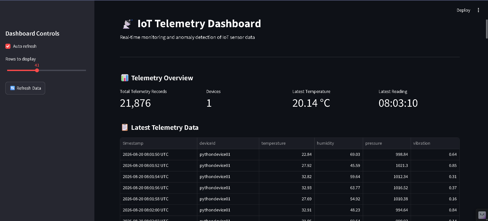

<div align="center">

# 🚀 IoT Real-Time Telemetry Monitoring \& Anomaly Detection System

### End-to-End IoT • Kafka Streaming • Machine Learning • Alerts • Dashboard


<p>
  <b>A complete real-time IoT data pipeline for telemetry generation,
  streaming, anomaly detection, alerting, and visualization.</b>
</p>

</div>

\---


## 📌 1. Project Overview


This project implements an **end-to-end IoT telemetry monitoring and anomaly detection system**.


The system simulates an IoT device that continuously generates sensor readings such as:

* 🌡️ **Temperature**
* 💧 **Humidity**
* 📊 **Pressure**
* 📳 **Vibration**


The generated telemetry is streamed through **Apache Kafka**, consumed and stored as telemetry data, analyzed using a **Machine Learning anomaly detection model**, processed by an **Alert Manager**, and finally displayed through an interactive **Streamlit Dashboard**.

### 

### 🔄 Complete Pipeline


```text
┌───────────────────────┐
│   IoT Sensor          │
│   Simulator           │
└──────────┬────────────┘
           │
           ▼
┌───────────────────────┐
│   Kafka Producer      │
│ kafka\_producer.py     │
└──────────┬────────────┘
           │
           ▼
┌───────────────────────┐
│ Apache Kafka + KRaft  │
│                       │
│  iot-telemetry Topic  │
└──────────┬────────────┘
           │
           ▼
┌───────────────────────┐
│   Kafka Consumer      │
│ kafka\_consumer.py     │
└──────────┬────────────┘
           │
           ▼
┌───────────────────────┐
│   Telemetry Storage   │
│   telemetry.csv       │
└──────────┬────────────┘
           │
           ▼
┌───────────────────────┐
│ Machine Learning      │
│ Anomaly Detection     │
└──────────┬────────────┘
           │
      ┌────┴─────┐
      ▼          ▼
   Normal      Anomaly
                  │
                  ▼
          ┌───────────────┐
          │ Alert Manager │
          └───────┬───────┘
                  │
                  ▼
        anomaly\_results.csv
                  │
                  ▼
        ┌──────────────────┐
        │ Streamlit        │
        │ Dashboard        │
        └──────────────────┘


🎯 2. Project Objectives


The main objectives of this project are:


| #  | Objective                                        |

| -- | ------------------------------------------------ |

| 1  | Simulate real-time IoT sensor telemetry          |

| 2  | Stream telemetry using \*\*Apache Kafka\*\*          |

| 3  | Demonstrate \*\*Kafka KRaft\*\* architecture         |

| 4  | Consume and process streaming data               |

| 5  | Store telemetry for further analysis             |

| 6  | Apply \*\*Machine Learning\*\* for anomaly detection |

| 7  | Generate anomaly scores and classifications      |

| 8  | Generate alerts for abnormal readings            |

| 9  | Visualize telemetry and anomalies                |

| 10 | Demonstrate a complete end-to-end data pipeline  |


✨ 3. Key Features


✅ IoT Sensor Simulation

✅ Real-Time Telemetry Generation

✅ Apache Kafka 4.3.1

✅ Kafka KRaft

✅ Kafka Producer

✅ Kafka Consumer

✅ iot-telemetry Kafka Topic

✅ Telemetry CSV Storage

✅ Machine Learning Anomaly Detection

✅ Serialized ML Model (model.pkl)

✅ Anomaly Scoring

✅ Alert Generation

✅ Streamlit Dashboard

✅ Telemetry Trend Visualization

✅ Anomaly Visualization

✅ Git/GitHub Version Control

✅ Modular Project Architecture


🏗️ 4. High-Level Architecture


&#x20;                 ┌─────────────────────┐

&#x20;                 │     IoT Device      │

&#x20;                 │    Sensor Simulator │

&#x20;                 └──────────┬──────────┘

&#x20;                            │

&#x20;                            ▼

&#x20;                 ┌─────────────────────┐

&#x20;                 │   Kafka Producer    │

&#x20;                 │ kafka\_producer.py   │

&#x20;                 └──────────┬──────────┘

&#x20;                            │

&#x20;                            ▼

&#x20;             ┌──────────────────────────────┐

&#x20;             │       Apache Kafka           │

&#x20;             │          + KRaft              │

&#x20;             │                              │

&#x20;             │      iot-telemetry           │

&#x20;             └──────────────┬───────────────┘

&#x20;                            │

&#x20;                            ▼

&#x20;                 ┌─────────────────────┐

&#x20;                 │   Kafka Consumer    │

&#x20;                 │ kafka\_consumer.py   │

&#x20;                 └──────────┬──────────┘

&#x20;                            │

&#x20;                            ▼

&#x20;                 ┌─────────────────────┐

&#x20;                 │   telemetry.csv     │

&#x20;                 └──────────┬──────────┘

&#x20;                            │

&#x20;                            ▼

&#x20;                 ┌─────────────────────┐

&#x20;                 │ Machine Learning    │

&#x20;                 │ Anomaly Detection   │

&#x20;                 └──────────┬──────────┘

&#x20;                            │

&#x20;                   ┌────────┴────────┐

&#x20;                   ▼                 ▼

&#x20;                NORMAL             ANOMALY

&#x20;                                     │

&#x20;                                     ▼

&#x20;                            ┌────────────────┐

&#x20;                            │ Alert Manager  │

&#x20;                            └───────┬────────┘

&#x20;                                    │

&#x20;                                    ▼

&#x20;                            ┌────────────────┐

&#x20;                            │ anomaly\_       │

&#x20;                            │ results.csv    │

&#x20;                            └───────┬────────┘

&#x20;                                    │

&#x20;                                    ▼

&#x20;                            ┌────────────────┐

&#x20;                            │   Streamlit    │

&#x20;                            │   Dashboard    │

&#x20;                            └────────────────┘


💡 Core Concept


Generate → Stream → Consume → Store → Analyze → Detect → Alert → Visualize


\---


\## 🛠️ 5. Technologies Used


| Category | Technology | Purpose |

|---|---|---|

| \*\*Programming\*\* | Python 3.12 | Application development and data processing |

| \*\*Streaming\*\* | Apache Kafka 4.3.1 | Real-time event streaming |

| \*\*Kafka Architecture\*\* | Kafka KRaft | Kafka metadata and controller management |

| \*\*Kafka Client\*\* | kafka-python | Python producer and consumer |

| \*\*Data Processing\*\* | Pandas | Data loading and processing |

| \*\*Data Processing\*\* | NumPy | Numerical operations |

| \*\*Machine Learning\*\* | Scikit-learn | Anomaly detection |

| \*\*ML Model\*\* | `model.pkl` | Serialized trained ML model |

| \*\*Dashboard\*\* | Streamlit | Interactive monitoring dashboard |

| \*\*Visualization\*\* | Plotly / visualization libraries | Charts and telemetry visualization |

| \*\*Development\*\* | Visual Studio Code | Development environment |

| \*\*Terminal\*\* | PowerShell | Project execution and administration |

| \*\*Version Control\*\* | Git | Source-code version control |

| \*\*Repository\*\* | GitHub | Project source-code hosting |


\---


\## 📁 6. Project Folder Structure


The project follows a modular structure where each major component has a dedicated folder.


```text

shadow project/

│

├── 📂 device/

│   ├── sensor.py

│   └── kafka\_producer.py

│

├── 📂 consumer/

│   └── kafka\_consumer.py

│

├── 📂 ml/

│   ├── anomaly\_detection.py

│   ├── live\_detector.py

│   └── model.pkl

│

├── 📂 alerts/

│   └── alert\_manager.py

│

├── 📂 dashboard/

│   └── app.py

│

├── 📂 data/

│   ├── telemetry.csv

│   └── anomaly\_results.csv

│

├── 📂 certs/

│   └── device certificates

│

├── 📄 config.py

├── 📄 requirements.txt

├── 📄 .gitignore

└── 📄 README.md


Kafka Installation


Apache Kafka is installed separately from the application source code.


The Kafka installation contains infrastructure/runtime directories such as:


Kafka/

│

├── bin/

├── config/

├── libs/

├── logs/

└── tmp/


🔧 7. Module Overview


| Module            | File                         | Responsibility                              |

| ----------------- | ---------------------------- | ------------------------------------------- |

| \*\*Device\*\*        | `device/sensor.py`           | Generates simulated IoT telemetry           |

| \*\*Producer\*\*      | `device/kafka\_producer.py`   | Publishes telemetry to Kafka                |

| \*\*Consumer\*\*      | `consumer/kafka\_consumer.py` | Consumes Kafka messages                     |

| \*\*ML Training\*\*   | `ml/anomaly\_detection.py`    | Performs anomaly detection/model processing |

| \*\*Live ML\*\*       | `ml/live\_detector.py`        | Evaluates incoming telemetry                |

| \*\*Model\*\*         | `ml/model.pkl`               | Stores the trained ML model                 |

| \*\*Alerts\*\*        | `alerts/alert\_manager.py`    | Handles anomaly alerts                      |

| \*\*Dashboard\*\*     | `dashboard/app.py`           | Displays telemetry and ML results           |

| \*\*Configuration\*\* | `config.py`                  | Stores project configuration                |

| \*\*Dependencies\*\*  | `requirements.txt`           | Python dependencies                         |


📡 8. Device Module


device/sensor.py


This module acts as an IoT sensor simulator.


It continuously generates sensor readings representing data that could be produced by a real IoT device.


Generated Sensor Parameters

🌡️ Temperature

💧 Humidity

📊 Pressure

📳 Vibration

🕐 Timestamp

🆔 Device ID


Example telemetry:


Temperature : 34.74

Humidity    : 60.10

Pressure    : 1007.56

Vibration   : 0.78


The purpose of this module is to simulate a real IoT device continuously producing telemetry.


📤 9. Kafka Producer

device/kafka\_producer.py


The Kafka producer takes telemetry generated by the IoT device and publishes it to Apache Kafka.


Kafka Connection

Broker:

localhost:9092


Kafka Topic

iot-telemetry


Producer Flow


Sensor Data

&#x20;    ↓

JSON Serialization

&#x20;    ↓

Kafka Producer

&#x20;    ↓

iot-telemetry Topic


The producer does not directly communicate with the consumer.


Instead:


Kafka acts as the middle layer between the producer and consumer.


This creates a decoupled streaming architecture.


🔄 10. Apache Kafka and KRaft


Apache Kafka is used as the event-streaming layer of the project.


The project uses:


Apache Kafka 4.3.1


with:


Kafka KRaft


What is KRaft?


KRaft is Kafka's metadata management architecture that removes the requirement for ZooKeeper.


The simplified architecture is:


┌───────────────────────┐

│    KRaft Controller   │

│  Cluster Metadata     │

└───────────┬───────────┘

&#x20;           │

&#x20;           ▼

┌───────────────────────┐

│    Kafka Broker       │

│                       │

│    iot-telemetry      │

│       Topic           │

└───────────────────────┘


Kafka Responsibilities


The Kafka broker:


Receives producer messages

Stores messages in Kafka topics

Serves consumer requests

Handles streaming of telemetry events


The KRaft controller:


Manages Kafka metadata

Maintains controller/quorum information

Coordinates Kafka cluster metadata


📨 11. Kafka Topic


The main Kafka topic used by this project is:


iot-telemetry


The producer publishes telemetry to this topic.


The consumer subscribes to this topic.


┌───────────────┐

│    Producer   │

└───────┬───────┘

&#x20;       │

&#x20;       ▼

┌────────────────────┐

│  iot-telemetry     │

│      Topic         │

└─────────┬──────────┘

&#x20;         │

&#x20;         ▼

┌───────────────┐

│    Consumer   │

└───────────────┘


This provides a decoupled and scalable streaming architecture.


📥 12. Kafka Consumer

consumer/kafka\_consumer.py


The Kafka consumer receives telemetry messages from:


iot-telemetry


It processes the incoming messages and stores the telemetry in:


data/telemetry.csv


Telemetry Fields


timestamp

deviceId

temperature

humidity

pressure

vibration


Consumer Flow:


Kafka Topic

&#x20;    ↓

Kafka Consumer

&#x20;    ↓

Receive Message

&#x20;    ↓

Parse Telemetry

&#x20;    ↓

Store Data

&#x20;    ↓

telemetry.csv


💾 13. Telemetry Data Storage


The primary telemetry dataset is:


data/telemetry.csv


Columns


| Column        | Description                       |

| ------------- | --------------------------------- |

| `timestamp`   | Time when telemetry was generated |

| `deviceId`    | IoT device identifier             |

| `temperature` | Temperature reading               |

| `humidity`    | Humidity reading                  |

| `pressure`    | Pressure reading                  |

| `vibration`   | Vibration reading                 |


Example:


2026-08-19T15:55:56+05:30

pythondevice01

34.74

60.10

1007.56

0.78


This file represents the telemetry generated by the simulated IoT device and consumed from Kafka.


\---


\## 🤖 14. Machine Learning Module


The Machine Learning functionality is located inside:


```text

ml/


Main ML Files


ml/

│

├── anomaly\_detection.py

├── live\_detector.py

└── model.pkl


The ML component analyzes IoT sensor features and identifies readings that are significantly different from normal behavior.


🧠 15. Anomaly Detection

ml/anomaly\_detection.py


This module is responsible for anomaly detection/model processing using telemetry data.


Processing Flow:


telemetry.csv

&#x20;     ↓

Load Telemetry Data

&#x20;     ↓

Select Sensor Features

&#x20;     ↓

Machine Learning Model

&#x20;     ↓

Calculate Anomaly Score

&#x20;     ↓

Classify Record

&#x20;     ↓

Normal / Anomaly

&#x20;     ↓

Generate Results


The model considers sensor characteristics such as:


🌡️ Temperature

💧 Humidity

📊 Pressure

📳 Vibration


📦 16. Trained ML Model

ml/model.pkl


model.pkl is the serialized trained anomaly detection model.


The model is loaded by the application when anomaly detection is performed.


Model Output


Each telemetry record can be classified as:


Normal


or:


Anomaly


An anomaly score is also produced to represent how unusual a particular observation is according to the model.


Example:


Anomaly Score: -0.01658


Important: The exact anomaly score depends on the trained model and the incoming telemetry values.


⚡ 17. Live Anomaly Detection

ml/live\_detector.py


This module supports anomaly detection on incoming telemetry as part of the live processing pipeline.


Instead of analyzing only previously stored data, incoming sensor readings can be evaluated by the ML model.


Live Detection Flow:


Incoming Telemetry

&#x20;       ↓

Sensor Features

&#x20;       ↓

ML Model

&#x20;       ↓

Anomaly Score

&#x20;       ↓

┌───────────────┐

│ Classification│

└───────┬───────┘

&#x20;       │

&#x20;  ┌────┴────┐

&#x20;  ▼         ▼

Normal    Anomaly

&#x20;            │

&#x20;            ▼

&#x20;         Alert


📊 18. Anomaly Results


The processed ML results are stored in:


data/anomaly\_results.csv


The results contain telemetry information together with the ML output.


Typical Fields


timestamp

deviceId

temperature

humidity

pressure

vibration

anomaly

anomaly\_score


Example


Temperature   : 28.07

Humidity      : 77.96

Pressure      : 1029.92

Vibration     : 0.27

Classification: Anomaly

Score         : -0.01658


The anomaly result dataset is used by the dashboard to display ML analysis.


🚨 19. Alert Module

alerts/alert\_manager.py


The Alert Manager handles the output generated when an abnormal sensor reading is detected.


When an anomaly is identified, the alert information can include:


🕐 Timestamp

🆔 Device ID

🌡️ Temperature

💧 Humidity

📊 Pressure

📳 Vibration

📈 Anomaly Score


Alert Flow


Machine Learning Detection

&#x20;           ↓

&#x20;       Anomaly

&#x20;           ↓

&#x20;    Alert Manager

&#x20;           ↓

&#x20;     Alert Output


Example:


========================================

&#x20;      ANOMALY DETECTED

========================================

Device       : pythondevice01

Temperature  : 79.72 °C

Humidity     : ...

Pressure     : ...

Vibration    : ...

Anomaly Score: ...

========================================


The Alert Manager provides a clear indication that an unusual reading has been detected.


🔗 20. ML + Alert Integration


The relationship between the ML and alert components is:


Telemetry

&#x20;   ↓

Feature Extraction

&#x20;   ↓

ML Model

&#x20;   ↓

Anomaly Score

&#x20;   ↓

Classification

&#x20;   ↓

&#x20;┌───────────────┐

&#x20;│               │

&#x20;▼               ▼

Normal        Anomaly

&#x20;               │

&#x20;               ▼

&#x20;         Alert Manager


This separates detection logic from alert handling, making the project easier to maintain and extend.


💡 21. Why Machine Learning Is Used


Traditional threshold-based monitoring might simply define rules such as:


Temperature > Fixed Limit

&#x20;       ↓

&#x20;     Alert


This project demonstrates a different approach using machine-learning based anomaly detection.


The model considers multiple sensor characteristics together:


Temperature

Humidity

Pressure

Vibration

&#x20;     ↓

Machine Learning Model

&#x20;     ↓

Anomaly Score

&#x20;     ↓

Normal / Anomaly


This allows the project to demonstrate intelligent detection of unusual telemetry patterns.


🔄 22. End-to-End ML Data Flow


IoT Sensor

&#x20;   ↓

Kafka Producer

&#x20;   ↓

Apache Kafka

&#x20;   ↓

Kafka Consumer

&#x20;   ↓

telemetry.csv

&#x20;   ↓

ML Processing

&#x20;   ↓

model.pkl

&#x20;   ↓

Anomaly Classification

&#x20;   ↓

anomaly\_results.csv

&#x20;   ↓

Alert Manager

&#x20;   ↓

Streamlit Dashboard


\---


\## 📊 23. Streamlit Dashboard


\### `dashboard/app.py`


The project includes an interactive \*\*Streamlit dashboard\*\* for monitoring IoT telemetry and machine-learning results.


The dashboard provides a single interface to understand the current state of the data pipeline.


\### Dashboard Responsibilities


The dashboard displays:


\- 📡 Telemetry records

\- 🆔 Device information

\- 🌡️ Latest sensor readings

\- 📈 Sensor trends

\- 🤖 ML results

\- 🚨 Detected anomalies

\- 📊 Anomaly scores

\- 🔄 Data pipeline status


\---


\## ▶️ 24. Starting the Dashboard


Activate the Python virtual environment:


```powershell

.\\.venv\\Scripts\\Activate.ps1


Start Streamlit:


streamlit run .\\dashboard\\app.py


The Streamlit application will start locally and provide a browser interface for monitoring the project.


📌 25. Dashboard Sections

25.1 Telemetry Overview


The dashboard provides a high-level summary of the telemetry data.


Typical metrics include:


| Metric                      | Description                               |

| --------------------------- | ----------------------------------------- |

| \*\*Total Telemetry Records\*\* | Number of available telemetry records     |

| \*\*Devices\*\*                 | Number of devices represented in the data |

| \*\*Latest Temperature\*\*      | Most recent temperature reading           |

| \*\*Latest Reading\*\*          | Time of the latest telemetry record       |


During testing, the dashboard successfully displayed thousands of telemetry records.


25.2 Latest Telemetry Data


This section displays the most recent sensor readings received by the system.


Typical fields include:


Timestamp

Device ID

Temperature

Humidity

Pressure

Vibration


The data originates from the telemetry generated by the IoT pipeline.


25.3 Telemetry Trends


The dashboard visualizes sensor values over time.


🌡️ Temperature


Shows how temperature changes across telemetry readings.


💧 Humidity


Shows humidity variations over time.


📊 Pressure


Shows pressure changes across the collected telemetry.


📳 Vibration


Shows vibration behavior and helps identify unusual changes.


These visualizations make it easier to identify trends and potentially unusual sensor behavior.


25.4 Anomaly Detection Summary


The dashboard provides a summary of machine-learning results.


Typical metrics include:


Total ML Results

Anomalies Detected

Normal Records


During project testing, an example result was:


| Metric               | Example Value |

| -------------------- | ------------: |

| \*\*Total ML Results\*\* |         5,374 |

| \*\*Anomalies\*\*        |            24 |

| \*\*Normal Records\*\*   |         5,350 |


Note: These values are examples from the testing dataset. The numbers can change as new telemetry is generated and processed.


25.5 Anomaly Detection History


The dashboard contains an anomaly-score history visualization.


It shows how anomaly scores change over time.


This helps the user understand:


Changes in model scores

Unusual observations

Distribution of normal and abnormal readings

Changes in telemetry behavior


25.6 Recent Anomalies


The dashboard provides a section containing recently detected anomalous records.


This allows the user to quickly identify:


Which device generated the anomaly

When it occurred

Sensor values associated with the anomaly

The corresponding anomaly score


25.7 Data Pipeline Status


The dashboard checks whether the required data sources are available.


The main data sources are:


data/telemetry.csv

data/anomaly\_results.csv


This helps confirm that the dashboard can access the telemetry and machine-learning result datasets.


🖥️ 26. Dashboard Monitoring Flow


&#x20;                ┌─────────────────────┐

&#x20;                │   Telemetry Data    │

&#x20;                │   telemetry.csv     │

&#x20;                └──────────┬──────────┘

&#x20;                           │

&#x20;                           ▼

&#x20;                ┌─────────────────────┐

&#x20;                │    ML Results       │

&#x20;                │ anomaly\_results.csv │

&#x20;                └──────────┬──────────┘

&#x20;                           │

&#x20;                           ▼

&#x20;                ┌─────────────────────┐

&#x20;                │ Streamlit Dashboard │

&#x20;                └──────────┬──────────┘

&#x20;                           │

&#x20;         ┌─────────────────┼─────────────────┐

&#x20;         ▼                 ▼                 ▼

&#x20;    Telemetry          Trends          Anomalies

&#x20;    Overview        Visualization       \& Scores


📷 27. Dashboard Demonstration


During the final demonstration, the dashboard can be used to show:


Telemetry Overview

Latest Telemetry Data

Temperature Trend

Humidity Trend

Pressure Trend

Vibration Trend

ML Result Summary

Anomaly Detection History

Recent Anomalies

Data Pipeline Status


This provides a visual representation of the complete processing pipeline.


🔍 28. What Data Is Generated?


The IoT simulator generates the following information:


| Data          | Type      | Purpose                                   |

| ------------- | --------- | ----------------------------------------- |

| `timestamp`   | Date/Time | Identifies when the reading was generated |

| `deviceId`    | String    | Identifies the IoT device                 |

| `temperature` | Numeric   | Temperature measurement                   |

| `humidity`    | Numeric   | Humidity measurement                      |

| `pressure`    | Numeric   | Pressure measurement                      |

| `vibration`   | Numeric   | Vibration measurement                     |


Example:


{

&#x20; "timestamp": "2026-08-19T15:55:56+05:30",

&#x20; "deviceId": "pythondevice01",

&#x20; "temperature": 34.74,

&#x20; "humidity": 60.10,

&#x20; "pressure": 1007.56,

&#x20; "vibration": 0.78

}


💾 29. What Data Is Stored?


Raw / Processed Telemetry

data/telemetry.csv


Contains the sensor telemetry consumed from Kafka.


Machine Learning Results

data/anomaly\_results.csv


Contains telemetry together with anomaly classifications and scores.


Trained Machine Learning Model

ml/model.pkl


Contains the serialized trained anomaly detection model.


Kafka Runtime Data


Apache Kafka also maintains its own internal topic and runtime data in its configured Kafka directories.


Note: Kafka runtime data is infrastructure data and is separate from the project's application-level CSV datasets.


\---


\## ⚙️ 30. Installation \& Setup


\### 30.1 Prerequisites


Before running the project, make sure the following are installed:


| Requirement | Purpose |

|---|---|

| \*\*Python 3.12\*\* | Run the application and ML components |

| \*\*Java\*\* | Required by Apache Kafka |

| \*\*Apache Kafka 4.3.1\*\* | Event streaming |

| \*\*Git\*\* | Version control |

| \*\*Visual Studio Code\*\* | Development environment |

| \*\*PowerShell\*\* | Project execution |


\---


\## 🐍 31. Python Environment Setup


\### Step 1 — Verify Python


Run:


```powershell

python --version


Expected:


Python 3.12.x


Step 2 — Create Virtual Environment


From the project root:


python -m venv .venv


Step 3 — Activate Virtual Environment

.\\.venv\\Scripts\\Activate.ps1


After activation, the terminal should show:


(.venv)

Step 4 — Install Python Dependencies

pip install -r requirements.txt

Step 5 — Verify Kafka Python Client

pip show kafka-python

☕ 32. Java Setup


Apache Kafka requires Java.


Verify the installed Java version:


java -version


The project was tested with a Java installation compatible with the Kafka environment.


📨 33. Kafka Setup


The project uses:


Apache Kafka 4.3.1


with:


Kafka KRaft


The Kafka broker is configured to communicate through:


localhost:9092


The main application topic is:


iot-telemetry

🏗️ 34. Kafka Runtime Architecture


The Kafka environment consists of:


KRaft Controller

&#x20;      ↓

Kafka Broker

&#x20;      ↓

iot-telemetry Topic

&#x20;      ↓

Kafka Consumer


The KRaft controller manages Kafka metadata and controller/quorum operations.


The Kafka broker handles producer and consumer communication and stores topic data.


🖥️ 35. Complete Project Demonstration


For a complete local demonstration, run the components in separate terminals.


Terminal Overview

Terminal	Component	Purpose

Terminal 1	KRaft Controller	Kafka metadata/controller

Terminal 2	Kafka Broker	Kafka event streaming

Terminal 3	IoT Producer	Generates and publishes telemetry

Terminal 4	Kafka Consumer	Receives and stores telemetry

Browser	Streamlit	Visual monitoring

▶️ 36. Running the Project

Terminal 1 — Start KRaft Controller


Start the Kafka KRaft controller using the configured Kafka controller configuration.


Keep this terminal running.


The exact configuration-file path depends on the local Kafka installation.


Terminal 2 — Start Kafka Broker


Start the Kafka broker using the configured Kafka broker configuration.


Keep this terminal running.


Verify that the Kafka broker is listening on port 9092:


Test-NetConnection 127.0.0.1 -Port 9092


Expected result:


TcpTestSucceeded : True

Terminal 3 — Start IoT Kafka Producer


Navigate to the project directory:


cd "C:\\Users\\Rohit\\Desktop\\shadow project"


Activate the environment:


.\\.venv\\Scripts\\Activate.ps1


Run the producer:


python .\\device\\kafka\_producer.py


The producer generates/sends telemetry to:


iot-telemetry


Expected behavior:


Sensor Data

&#x20;    ↓

JSON Message

&#x20;    ↓

Kafka Producer

&#x20;    ↓

iot-telemetry


Keep this terminal running.


Terminal 4 — Start Kafka Consumer


Open another PowerShell terminal.


Navigate to the project:


cd "C:\\Users\\Rohit\\Desktop\\shadow project"


Activate the environment:


.\\.venv\\Scripts\\Activate.ps1


Run:


python .\\consumer\\kafka\_consumer.py


The consumer subscribes to:


iot-telemetry


and processes incoming telemetry.


The telemetry is stored in:


data/telemetry.csv


Keep this terminal running.


🌐 37. Start Streamlit Dashboard


Open another PowerShell terminal.


Navigate to the project:


cd "C:\\Users\\Rohit\\Desktop\\shadow project"


Activate the environment:


.\\.venv\\Scripts\\Activate.ps1


Run:


streamlit run .\\dashboard\\app.py


The Streamlit application opens in the browser.


The dashboard reads the generated telemetry and ML results and presents them through charts, metrics, and tables.


### Dashboard Preview

The following screenshot shows the IoT Telemetry Dashboard running with telemetry and anomaly detection results.




🔄 38. Complete Runtime Flow


Once all components are running:


┌─────────────────────┐

│   IoT Sensor        │

│   Simulator         │

└─────────┬───────────┘

&#x20;         │

&#x20;         ▼

┌─────────────────────┐

│   Kafka Producer    │

└─────────┬───────────┘

&#x20;         │

&#x20;         ▼

┌─────────────────────┐

│  Kafka Broker       │

│      KRaft          │

└─────────┬───────────┘

&#x20;         │

&#x20;         ▼

┌─────────────────────┐

│  iot-telemetry      │

│      Topic          │

└─────────┬───────────┘

&#x20;         │

&#x20;         ▼

┌─────────────────────┐

│   Kafka Consumer    │

└─────────┬───────────┘

&#x20;         │

&#x20;         ▼

┌─────────────────────┐

│   telemetry.csv     │

└─────────┬───────────┘

&#x20;         │

&#x20;         ▼

┌─────────────────────┐

│ Machine Learning    │

│ Anomaly Detection   │

└─────────┬───────────┘

&#x20;         │

&#x20;    ┌────┴─────┐

&#x20;    ▼          ▼

&#x20; Normal      Anomaly

&#x20;                │

&#x20;                ▼

&#x20;        ┌──────────────┐

&#x20;        │ Alert Manager│

&#x20;        └──────┬───────┘

&#x20;               │

&#x20;               ▼

&#x20;     anomaly\_results.csv

&#x20;               │

&#x20;               ▼

&#x20;      ┌─────────────────┐

&#x20;      │    Streamlit    │

&#x20;      │    Dashboard    │

&#x20;      └─────────────────┘

🧪 39. Verification Checklist


After starting the system, verify each component.


Kafka

Test-NetConnection 127.0.0.1 -Port 9092


Expected:


TcpTestSucceeded : True

Producer


Verify that telemetry messages are continuously being generated and published.


Consumer


Verify that telemetry messages are being received.


Telemetry File


Verify:


data/telemetry.csv


is being populated.


Machine Learning


Verify that the ML model loads successfully:


ml/model.pkl

Anomaly Results


Verify:


data/anomaly\_results.csv


contains ML results.


Alerts


Verify that anomalous readings produce alert output when detected.


Dashboard


Verify that Streamlit displays:


Telemetry metrics

Latest readings

Sensor trends

ML results

Anomalies

Anomaly scores


